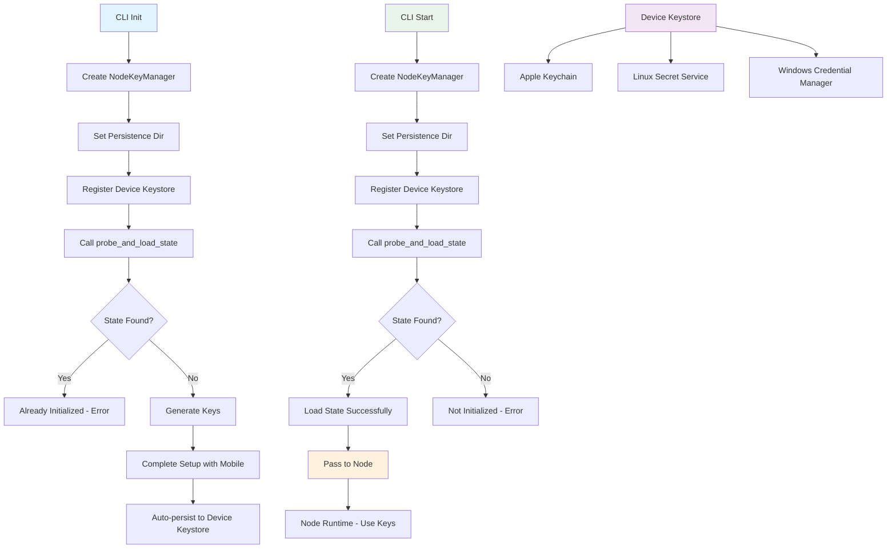

You're absolutely right! I was looking at the old CLI flow. Let me examine the current lifecycle test to understand the correct new flow:


[1 tool called]

Now let me check how the CLI should actually be implemented with the new flow:


[1 tool called]

You're absolutely correct! The CLI is using the **old flow**. Let me document the **correct new flow** based on the lifecycle test:

## **✅ CORRECT NEW KEYSTORE STATE MANAGEMENT FLOW**

### **�� NEW CLI FLOW (Based on `lifecycle_test.rs`)**

#### **1. CLI Start Flow (Should be updated)**
```rust
// OLD (incorrect) - CLI start.rs
let node_key_manager = self.load_node_keys(&config)?; // ❌ Manual OS key store loading

// NEW (correct) - Should be:
fn load_node_keys(&self, config: &CliNodeConfig) -> Result<NodeKeyManager> {
    // Create NodeKeyManager
    let logger = Arc::new(Logger::new_root(Component::Keys));
    let mut node_key_manager = NodeKeyManager::new(logger)?;
    
    // Configure persistence directory
    node_key_manager.set_persistence_dir(config.persistence_dir.clone());
    
    // Register device keystore (OS key store integration)
    let device_keystore = create_device_keystore_for_platform()?;
    node_key_manager.register_device_keystore(device_keystore);
    
    // Try to load existing state
    let state_loaded = node_key_manager.probe_and_load_state()?;
    
    if state_loaded {
        log_info!(self.logger, "Loaded existing node keys from device keystore");
    } else {
        log_info!(self.logger, "No existing state found - new node initialization required");
        // This means it's a brand new node - needs initialization
        return Err(anyhow::anyhow!("Node not initialized - run 'runar init' first"));
    }
    
    Ok(node_key_manager)
}
```

#### **2. CLI Init Flow (Should be updated)**
```rust
// OLD (incorrect) - CLI init.rs
let node_state = node_key_manager.export_state();
let serialized_state = to_vec(&node_state)?;
key_store.store_node_keys(keys_name, &serialized_state)?; // ❌ Manual OS key store

// NEW (correct) - Should be:
fn initialize_node(&self) -> Result<()> {
    // Create NodeKeyManager
    let logger = Arc::new(Logger::new_root(Component::Keys));
    let mut node_key_manager = NodeKeyManager::new(logger)?;
    
    // Configure persistence directory
    node_key_manager.set_persistence_dir(self.config_dir.clone());
    
    // Register device keystore (OS key store integration)
    let device_keystore = create_device_keystore_for_platform()?;
    node_key_manager.register_device_keystore(device_keystore);
    
    // Check if already initialized
    let state_loaded = node_key_manager.probe_and_load_state()?;
    if state_loaded {
        return Err(anyhow::anyhow!("Node already initialized"));
    }
    
    // Generate keys (new node)
    node_key_manager.generate_keys()?;
    
    // Complete setup with mobile app
    // ... certificate installation, network key setup ...
    
    // State is automatically persisted via auto_persist = true
    // No manual export/store needed!
    
    Ok(())
}
```

### **🏗️ DEVICE KEYSTORE INTEGRATION**

The new flow uses the **device keystore** directly instead of manual OS key store operations:

```rust
// Platform-specific device keystore creation
fn create_device_keystore_for_platform() -> Result<Arc<dyn DeviceKeystore>> {
    #[cfg(target_os = "macos")]
    {
        Ok(Arc::new(AppleKeyStore::new()?))
    }
    #[cfg(target_os = "linux")]
    {
        Ok(Arc::new(LinuxKeyStore::new()?))
    }
    #[cfg(target_os = "windows")]
    {
        Ok(Arc::new(WindowsKeyStore::new()?))
    }
    #[cfg(not(any(target_os = "macos", target_os = "linux", target_os = "windows")))]
    {
        Err(anyhow::anyhow!("Unsupported platform"))
    }
}
```

### **�� CORRECTED DATA FLOW DIAGRAM**



### **🚫 WHY `rn_keys_node_get_keystore_state` IS OBSOLETE**

1. **State management is handled by `probe_and_load_state()`** - No need to expose to FFI
2. **Device keystore handles encryption/persistence** - OS integration is automatic
3. **Auto-persistence is enabled by default** - State is automatically saved
4. **CLI manages the lifecycle** - FFI only needs core crypto operations
5. **`probe_and_load_state()` returns boolean** - Simple success/failure indication

### **✅ UPDATED CLI IMPLEMENTATION NEEDED**

The CLI needs to be updated to use the new flow:

1. **Remove manual OS key store operations** (`OsKeyStore` class)
2. **Use `probe_and_load_state()`** instead of manual state loading
3. **Register device keystore** instead of manual keyring operations
4. **Let auto-persistence handle state saving** instead of manual export/store

The current CLI is using the old manual approach, but the new architecture with `probe_and_load_state()` and device keystore integration is much cleaner and more secure.