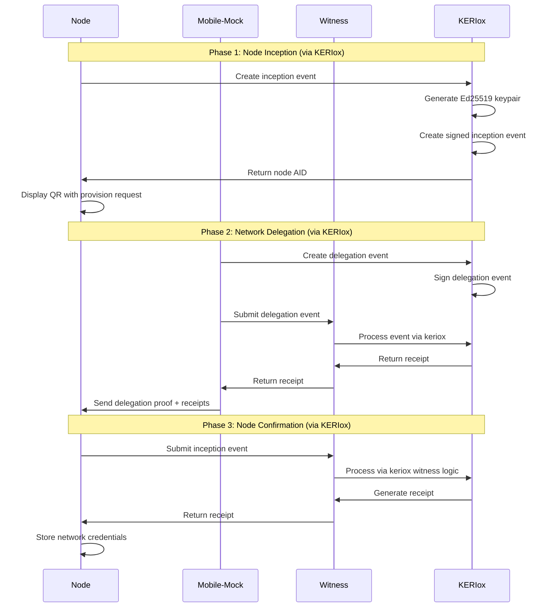
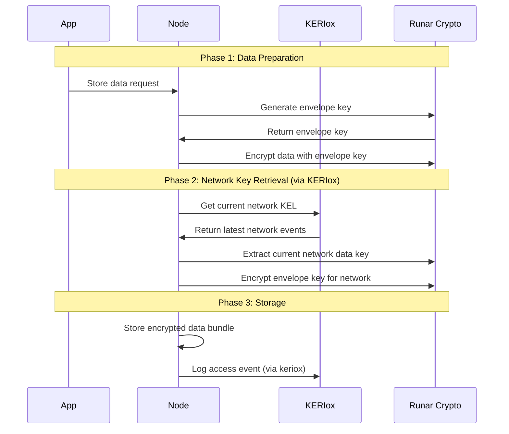

# Runar KERI Implementation Plan Using KERIox

*Status: Implementation Specification – Ready for Development*

This document specifies the complete implementation plan for KERI-based key management in Runar, **leveraging the mature KERIox library** as the foundation instead of building KERI from scratch.

**Target**: Full production implementation using proven KERI primitives from keriox.

---

## 1. KERIox Analysis and Integration Strategy

### 1.1 KERIox Capabilities Assessment

**KERIox (v0.8.0)** provides mature KERI implementation with:

- **Core KERI Operations**: Inception, Rotation, Interaction, Delegation events
- **Database Layer**: SledEventDatabase for production storage
- **Event Processing**: Full KEL validation, ordering, and conflict resolution
- **Cryptographic Operations**: Ed25519, secp256k1, multi-signature support
- **Witness Support**: Built-in witness logic and receipt handling
- **Async Support**: Full async/await compatibility
- **Serialization**: JSON and CBOR support with canonical serialization

**Key Advantages Over Custom Implementation**:
- **Proven Implementation**: 2+ years of development, extensive testing
- **KERI Compliance**: Full compliance with KERI specification
- **Performance**: Optimized event processing and storage
- **Maintenance**: Active development by WebOfTrust foundation
- **Security**: Peer-reviewed cryptographic implementations

### 1.2 Runar-Specific Extensions Needed

While keriox provides KERI primitives, we need Runar-specific extensions:

```rust
// Runar-specific data structures built on keriox
use keri::{
    processor::Processor,
    database::sled::SledEventDatabase,
    event_message::signed_event_message::SignedEventMessage,
    prefix::IdentifierPrefix,
    state::IdentifierState,
};

#[derive(Debug, Clone)]
pub struct RunarNetwork {
    /// Network identifier (KERI AID)
    pub network_aid: IdentifierPrefix,
    /// Current network data encryption key
    pub current_data_key: PublicKey,
    /// Network metadata
    pub metadata: NetworkMetadata,
    /// KERI processor for this network
    pub keri_processor: Arc<Processor>,
}

#[derive(Debug, Clone)]
pub struct RunarNode {
    /// Node identifier (KERI AID)
    pub node_aid: IdentifierPrefix,
    /// Network memberships
    pub networks: HashMap<IdentifierPrefix, NetworkMembership>,
    /// Local KERI processor
    pub keri_processor: Arc<Processor>,
    /// Data encryption service
    pub crypto_service: Arc<RunarCryptoService>,
}
```

---

## 2. Implementation Architecture

### 2.1 Component Overview

```
┌─────────────────┐    ┌─────────────────┐    ┌─────────────────┐
│   Mobile-Mock   │    │   Witness       │    │   Node          │
│   (Wallet)      │    │   Server        │    │   Daemon        │
│                 │    │                 │    │                 │
│ • KERIox        │◄──►│ • KERIox        │◄──►│ • KERIox        │
│ • User KEL      │    │ • KEL Storage   │    │ • Node KEL      │
│ • Network Mgmt  │    │ • Witness Logic │    │ • Data Encrypt  │
│ • Runar Logic   │    │ • REST API      │    │ • Runar Logic   │
└─────────────────┘    └─────────────────┘    └─────────────────┘
```

### 2.2 Crate Structure

```
runar-keri/
├── runar-keri-core/           # Runar extensions on keriox
├── runar-keri-mobile-mock/    # Mobile wallet simulator
├── runar-keri-witness/        # Witness server (keriox + REST)
├── runar-keri-node/          # Node daemon
└── runar-keri-integration/   # Integration tests
```

**Key Difference**: We build Runar-specific logic on top of keriox rather than reimplementing KERI.

---

## 3. API Specifications

### 3.1 Runar-KERI Core Wrapper

```rust
use keri::{
    processor::Processor,
    database::sled::SledEventDatabase,
    event_message::signed_event_message::SignedEventMessage,
    prefix::IdentifierPrefix,
    state::IdentifierState,
    signer::CryptoBox,
};

#[async_trait]
pub trait RunarKeriService {
    /// Initialize new user identity using keriox
    async fn create_user_identity(&mut self) -> Result<IdentifierPrefix>;
    
    /// Create network identity with delegation
    async fn create_network(&mut self, name: String, config: NetworkConfig) -> Result<IdentifierPrefix>;
    
    /// Delegate node access to network
    async fn delegate_node_access(&mut self, 
        network_aid: IdentifierPrefix,
        node_request: NodeProvisionRequest
    ) -> Result<DelegationProof>;
    
    /// Rotate network data keys
    async fn rotate_network_keys(&mut self, network_aid: IdentifierPrefix) -> Result<()>;
}

pub struct RunarKeriCore {
    /// Core keriox processor
    keri_processor: Arc<Processor>,
    /// Database (provided by keriox)
    database: Arc<SledEventDatabase>,
    /// Crypto operations (provided by keriox)
    crypto_box: Arc<Mutex<CryptoBox>>,
    /// Runar-specific state
    runar_state: RunarState,
}
```

### 3.2 Mobile-Mock APIs (Built on KERIox)

```rust
pub struct MobileMock {
    /// Core KERI functionality from keriox
    keri_service: RunarKeriCore,
    /// Runar-specific extensions
    network_manager: NetworkManager,
    node_manager: NodeManager,
    profile_manager: ProfileManager,
}

#[async_trait]
impl UserManager for MobileMock {
    async fn create_user(&mut self, seed_phrase: Option<String>) -> Result<IdentifierPrefix> {
        // Use keriox to create inception event
        let user_aid = self.keri_service.create_user_identity().await?;
        
        // Store Runar-specific metadata
        self.store_user_metadata(user_aid.clone()).await?;
        
        Ok(user_aid)
    }
    
    async fn export_backup(&self) -> Result<EncryptedBackup> {
        // Export KEL using keriox
        let kel_events = self.keri_service.export_user_kel().await?;
        
        // Encrypt with user-provided password
        let encrypted_backup = self.encrypt_backup(kel_events).await?;
        
        Ok(encrypted_backup)
    }
}
```

### 3.3 Witness Server (KERIox + REST)

```rust
use keri::{
    processor::Processor,
    database::sled::SledEventDatabase,
    event_message::signed_event_message::SignedEventMessage,
};

pub struct RunarWitnessServer {
    /// Core keriox processor handles witness logic
    keri_processor: Arc<Processor>,
    /// REST API server
    api_server: WitnessApiServer,
    /// Witness configuration
    config: WitnessConfig,
}

// REST API built on top of keriox witness functionality
#[utoipa::path(post, path = "/events")]
async fn submit_event(
    event: web::Json<SignedEventMessage>
) -> Result<Receipt> {
    // Use keriox processor to handle event
    let receipt = processor.process_event(event.into_inner()).await?;
    Ok(receipt)
}

#[utoipa::path(get, path = "/kel/{aid}")]
async fn get_kel(
    aid: web::Path<String>
) -> Result<Vec<SignedEventMessage>> {
    // Use keriox to retrieve KEL
    let aid_prefix = IdentifierPrefix::new(&aid)?;
    let kel_events = processor.get_kel_for_prefix(&aid_prefix).await?;
    Ok(kel_events)
}
```

---

## 4. Data Flow Specifications

### 4.1 Node Provisioning Using KERIox



### 4.2 Data Encryption Flow (KERIox + Runar Crypto)



---

## 5. Implementation Phases

### 5.1 Phase 1: KERIox Integration (Months 1-2)

#### 5.1.1 Core Integration
- [ ] Add keriox dependency (v0.8.0)
- [ ] Create `RunarKeriCore` wrapper around keriox `Processor`
- [ ] Implement Runar-specific event types as extensions
- [ ] Test basic KERI operations (inception, rotation, interaction)

#### 5.1.2 Database Integration
- [ ] Configure keriox `SledEventDatabase` for Runar
- [ ] Implement Runar-specific storage for network/node metadata
- [ ] Create backup/restore functionality using keriox KEL export

```rust
[dependencies]
keri = { version = "0.8.0", features = ["sled-db", "async"] }
sled = "0.34"
tokio = { version = "1.0", features = ["full"] }
serde = { version = "1.0", features = ["derive"] }
```

### 5.2 Phase 2: Component Development (Months 3-6)

#### 5.2.1 Mobile-Mock Implementation
- [ ] Wrap keriox functionality for user/network/node management
- [ ] Implement Runar-specific delegation logic
- [ ] Create secure storage for private keys (using keriox signer)
- [ ] Build backup/restore using keriox KEL operations

#### 5.2.2 Witness Server
- [ ] Build REST API on top of keriox witness functionality
- [ ] Use keriox `Processor` for all witness operations
- [ ] Implement witness pool communication
- [ ] Add monitoring and logging around keriox operations

#### 5.2.3 Node Daemon
- [ ] Integrate keriox for node identity management
- [ ] Implement data encryption on top of KERI events
- [ ] Create network communication using KERI receipts
- [ ] Build local storage with keriox event logging

### 5.3 Phase 3: Integration Testing (Months 7-9)

Focus on testing Runar logic built on proven keriox foundation:

```rust
#[tokio::test]
async fn test_full_provisioning_with_keriox() {
    // Start witness with keriox processor
    let witness = start_keriox_witness_server().await;
    
    // Initialize mobile-mock with keriox
    let mut mobile = MobileMock::new_with_keriox(test_config()).await;
    let user_aid = mobile.create_user(None).await.unwrap();
    let network_aid = mobile.create_network("test-net".to_string()).await.unwrap();
    
    // Node with keriox processor
    let mut node = Node::new_with_keriox(test_node_config()).await;
    let provision_request = node.request_membership(network_aid).await.unwrap();
    
    // Test delegation using keriox events
    let delegation_proof = mobile.provision_node(provision_request).await.unwrap();
    node.process_delegation(delegation_proof).await.unwrap();
    
    // Verify using keriox state
    assert!(node.can_access_network(network_aid).await.unwrap());
}
```

### 5.4 Phase 4: Production Readiness (Months 10-12)

- [ ] Performance optimization of Runar logic on keriox
- [ ] Security audit of Runar extensions
- [ ] Production deployment tooling
- [ ] Migration utilities from existing systems

---

## 6. Key Advantages of KERIox-Based Approach

### 6.1 **Reduced Implementation Risk**
- **From HIGH to MEDIUM**: Leveraging proven KERI implementation
- **Timeline**: 12 months instead of 18+ months for custom KERI
- **Maintenance**: WebOfTrust foundation maintains core KERI logic

### 6.2 **Focus on Runar Value-Add**
- **80% effort** on Runar-specific logic (data encryption, network management, mobile UX)
- **20% effort** on KERI integration instead of KERI implementation
- **Proven foundation** allows focus on Runar requirements

### 6.3 **Future-Proofing**
- **KERI Updates**: Automatic benefit from keriox improvements
- **Standards Compliance**: Always compliant with latest KERI spec
- **Ecosystem Integration**: Compatible with other KERI implementations

### 6.4 **Performance Benefits**
- **Optimized Storage**: SledEventDatabase is production-tested
- **Efficient Processing**: Event validation and ordering optimized
- **Memory Management**: Proven memory-safe Rust implementation

---

## 7. Risk Mitigation

### 7.1 **KERIox Dependency Risk**
- **Mitigation**: KERIox is actively maintained by WebOfTrust foundation
- **Fallback**: Can fork keriox if needed (Apache 2.0 license)
- **Assessment**: LOW risk - stable, mature codebase

### 7.2 **Integration Complexity**
- **Mitigation**: Start with simple wrapper, evolve gradually
- **Testing**: Extensive integration tests with keriox
- **Assessment**: MEDIUM risk - manageable with proper abstraction

### 7.3 **Performance Concerns**
- **Mitigation**: Benchmark early, optimize Runar-specific code
- **Monitoring**: Use keriox metrics as baseline
- **Assessment**: LOW risk - keriox is production-ready

---

## 8. Success Criteria

### 8.1 **Functional Requirements**
- [ ] All Runar requirements met using keriox foundation
- [ ] Node provisioning < 30 seconds (including KERI operations)
- [ ] Support 100+ nodes per network (leveraging keriox scalability)
- [ ] Key rotation across network in < 5 minutes

### 8.2 **Integration Requirements**
- [ ] Seamless keriox integration with no exposed KERI complexity
- [ ] All KERI operations abstracted behind Runar APIs
- [ ] Backup/restore preserves full KERI event history
- [ ] Migration path from existing Runar systems

### 8.3 **Operational Requirements**
- [ ] Production deployment using keriox database
- [ ] Monitoring of both Runar and keriox metrics
- [ ] CLI tools for keriox event inspection and debugging
- [ ] Documentation covering keriox integration points

---

## 9. Implementation Recommendations

### 9.1 **Start Simple**
Begin with basic keriox wrapper, add Runar features incrementally:

```rust
// Phase 1: Basic wrapper
pub struct RunarKeriCore {
    keri_processor: Arc<Processor>,
}

// Phase 2: Add Runar extensions
pub struct RunarKeriCore {
    keri_processor: Arc<Processor>,
    network_manager: NetworkManager,    // Runar-specific
    data_encryption: DataService,       // Runar-specific
}
```

### 9.2 **Maintain Clear Abstraction**
Keep keriox implementation details hidden from Runar application logic:

```rust
// Good: Clean Runar API
async fn provision_node(request: NodeProvisionRequest) -> Result<DelegationProof>;

// Avoid: Exposing keriox details
async fn provision_node(request: NodeProvisionRequest) -> Result<SignedEventMessage>;
```

### 9.3 **Comprehensive Testing**
Test both Runar logic and keriox integration:

```rust
// Unit tests: Runar logic only
// Integration tests: Runar + keriox
// E2E tests: Full system with keriox witness
```

---

**Implementation Status**: Ready to begin with proven keriox foundation

*This approach reduces implementation risk, accelerates timeline, and allows focus on Runar's unique value proposition while leveraging mature KERI primitives.*