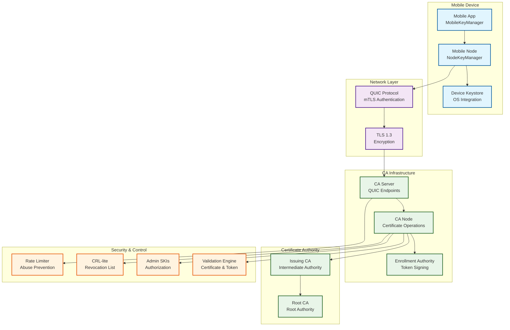
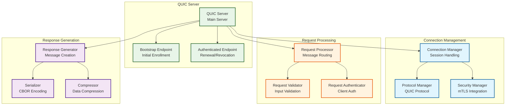
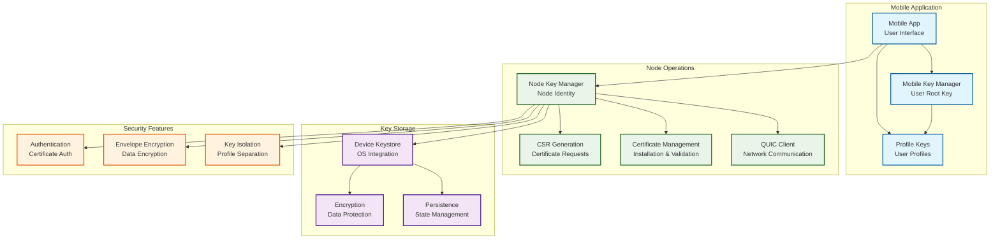
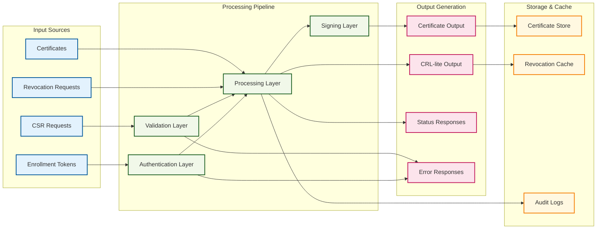
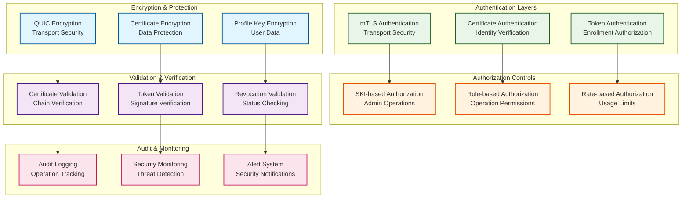
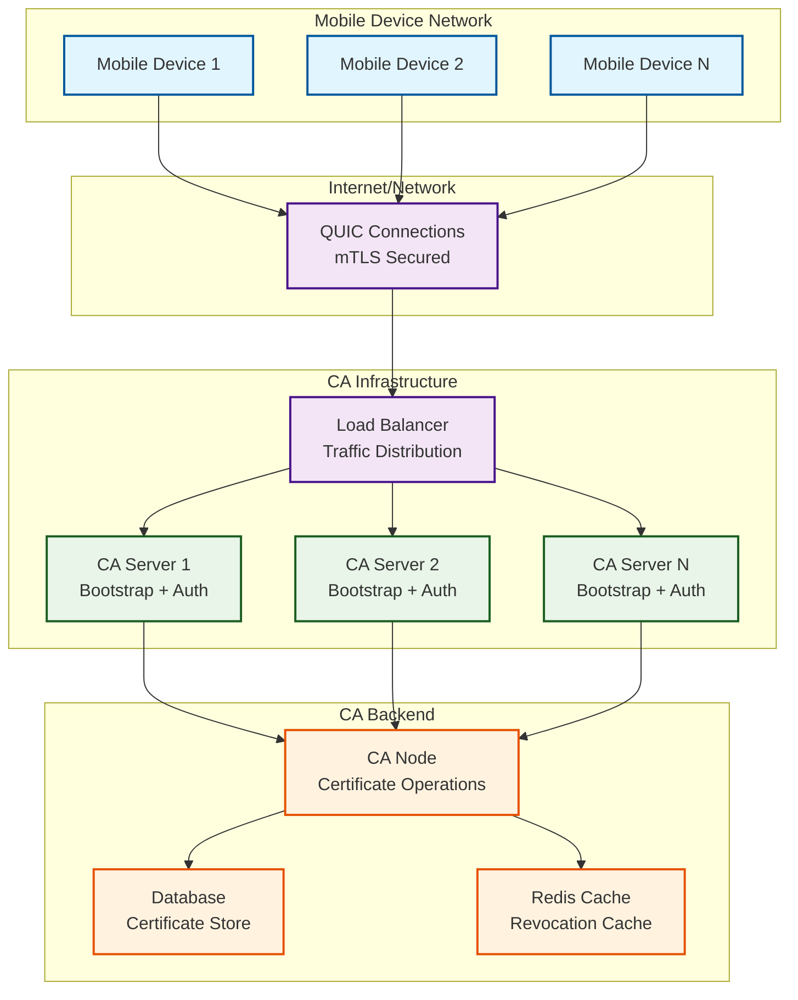
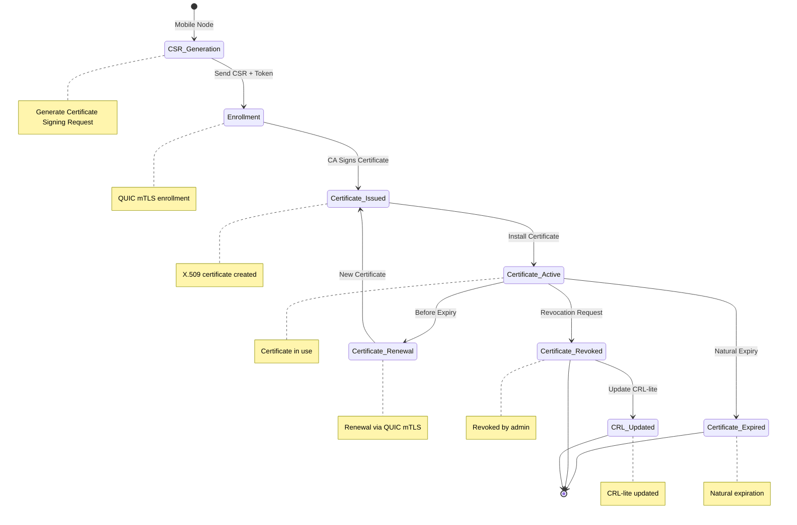
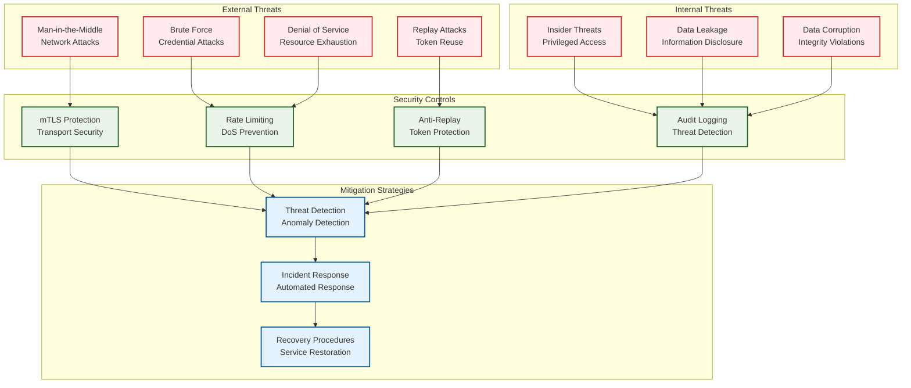
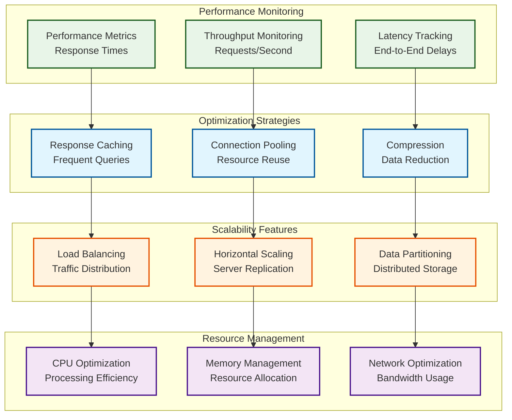

# Component Architecture Diagrams

## 1. High-Level System Architecture

## 2. Detailed CA Node Architecture

```mermaid
graph TB
    subgraph "CA Node Core"
        CN[CA Node<br/>Main Controller]
        CM[Certificate Manager<br/>Issuance & Validation]
        RM[Revocation Manager<br/>CRL Generation]
        TM[Token Manager<br/>Enrollment Tokens]
    end

    subgraph "Certificate Operations"
        CSR[CSR Processing<br/>Request Validation]
        SIGN[Certificate Signing<br/>X.509 Generation]
        VAL[Certificate Validation<br/>Chain Verification]
        REV[Certificate Revocation<br/>Status Management]
    end

    subgraph "Security Controls"
        AUTH[Authentication<br/>SKI-based Auth]
        RATE[Rate Limiting<br/>Request Throttling]
        ANTI[Anti-Replay<br/>Token Replay Protection]
        AUDIT[Audit Logging<br/>Operation Tracking]
    end

    subgraph "External Interfaces"
        API[CA API<br/>REST/QUIC Endpoints]
        STORE[Certificate Store<br/>Persistent Storage]
        CACHE[Revocation Cache<br/>CRL-lite Storage]
    end

    CN --> CM
    CN --> RM
    CN --> TM

    CM --> CSR
    CM --> SIGN
    CM --> VAL
    RM --> REV

    CN --> AUTH
    CN --> RATE
    CN --> ANTI
    CN --> AUDIT

    CN --> API
    CN --> STORE
    CN --> CACHE

    classDef core fill:#e8f5e8,stroke:#1b5e20,stroke-width:2px
    classDef ops fill:#e1f5fe,stroke:#01579b,stroke-width:2px
    classDef security fill:#fff3e0,stroke:#e65100,stroke-width:2px
    classDef interface fill:#f3e5f5,stroke:#4a148c,stroke-width:2px

    class CN,CM,RM,TM core
    class CSR,SIGN,VAL,REV ops
    class AUTH,RATE,ANTI,AUDIT security
    class API,STORE,CACHE interface
```

## 3. QUIC Transport Architecture

## 4. Mobile Node Architecture

## 5. Data Flow Architecture

## 6. Security Model Architecture

## 7. Network Topology

## 8. Certificate Lifecycle

## 9. Security Threat Model

## 10. Performance Architecture

