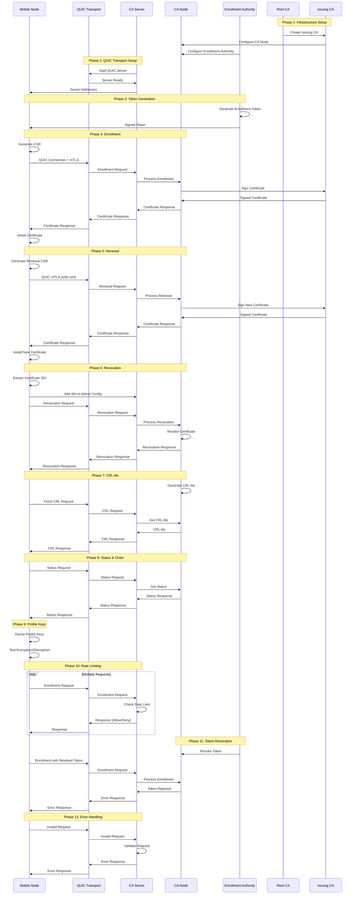

# Full Transport End-to-End Test Design

## Overview

The Full Transport E2E test validates the complete CA Node infrastructure with **REAL QUIC mTLS connections**, including bootstrap enrollment, mTLS participation, renewal, and CRL-lite enforcement. This test serves as the definitive validation that the entire Runar certificate authority system works correctly in a production-like environment.

## Test Architecture

### Components

- **CA Node**: Certificate Authority Node with enrollment authority
- **CA Server**: QUIC-based server for CA operations (Bootstrap + Authenticated)
- **CA Client**: QUIC-based client for mobile node operations
- **Mobile Node**: NodeKeyManager for mobile device operations
- **Mobile App**: MobileKeyManager for mobile app operations
- **Root CA**: Root Certificate Authority
- **Issuing CA**: Intermediate Certificate Authority

### Key Technologies

- **QUIC Protocol**: Modern transport protocol with built-in encryption
- **mTLS**: Mutual TLS authentication for client-server communication
- **X.509 Certificates**: Standard certificate format
- **ECDSA P-256**: Elliptic curve digital signature algorithm
- **CBOR**: Concise Binary Object Representation for data serialization

---

## Test Phases

### Phase 1: CA Node Infrastructure Setup

**Purpose**: Establish the certificate authority infrastructure

**What it does**:
- Creates a Root CA certificate
- Creates an Issuing CA certificate signed by the Root CA
- Creates a CA Node with the Issuing CA
- Configures an enrollment authority with a signing key

**Why needed**: 
- Provides the foundation for all certificate operations
- Establishes trust hierarchy (Root CA → Issuing CA → End Entity certificates)
- Enables enrollment authority to sign enrollment tokens

**Data Flow**:
```
Root CA → Issuing CA → CA Node → Enrollment Authority
```

### Phase 2: REAL QUIC Transport Setup

**Purpose**: Configure and start the QUIC-based CA server

**What it does**:
- Creates CA Server configuration with real ports
- Starts CA Server with bootstrap and authenticated endpoints
- Creates CA Client configuration for mobile node
- Establishes QUIC transport infrastructure

**Why needed**:
- Provides network transport for all CA operations
- Enables secure communication between mobile nodes and CA
- Supports both bootstrap (initial enrollment) and authenticated (renewal/revocation) operations

**Data Flow**:
```
CA Server ←→ QUIC Transport ←→ CA Client
```

### Phase 3: Enrollment Token Generation

**Purpose**: Create a valid enrollment token for mobile node registration

**What it does**:
- Generates enrollment token with specific validity period
- Signs token with enrollment authority key
- Configures token for specific network and permissions

**Why needed**:
- Provides authorization for mobile node enrollment
- Prevents unauthorized certificate requests
- Enables time-limited access control

**Data Flow**:
```
Enrollment Authority → Token Generation → Signed Token
```

### Phase 4: Mobile Node Enrollment via REAL QUIC mTLS

**Purpose**: Enroll mobile node and obtain initial certificate

**What it does**:
- Mobile node generates CSR (Certificate Signing Request)
- Establishes QUIC connection to CA Server
- Performs mTLS handshake
- Sends enrollment request with CSR and token
- Receives and installs certificate

**Why needed**:
- Provides mobile node with valid certificate for network participation
- Establishes identity and authentication credentials
- Enables subsequent authenticated operations

**Data Flow**:
```
Mobile Node → CSR + Token → QUIC → CA Server → Certificate → Mobile Node
```

### Phase 5: Certificate Renewal via REAL QUIC mTLS

**Purpose**: Renew mobile node certificate using existing credentials

**What it does**:
- Mobile node generates new CSR
- Establishes QUIC connection with existing certificate
- Performs mTLS handshake using current certificate
- Sends renewal request
- Receives and installs renewed certificate

**Why needed**:
- Maintains valid certificate for continued network access
- Demonstrates authenticated renewal process
- Validates mTLS authentication with existing credentials

**Data Flow**:
```
Mobile Node (with cert) → Renewal CSR → QUIC mTLS → CA Server → New Certificate
```

### Phase 6: Certificate Revocation via REAL QUIC mTLS

**Purpose**: Revoke mobile node certificate and generate CRL-lite

**What it does**:
- Extracts SKI (Subject Key Identifier) from mobile certificate
- Adds SKI to CA Server admin configuration
- Sends revocation request with certificate serial
- Generates CRL-lite (Certificate Revocation List)
- Validates revocation was successful

**Why needed**:
- Demonstrates certificate lifecycle management
- Shows how to revoke compromised certificates
- Validates CRL-lite generation for certificate status checking

**Data Flow**:
```
Mobile Node → Revocation Request → QUIC mTLS → CA Server → CRL-lite Generation
```

### Phase 7: CRL-lite Generation and Validation

**Purpose**: Generate and fetch Certificate Revocation List

**What it does**:
- CA Node generates CRL-lite with revoked certificates
- Mobile node fetches CRL-lite via QUIC mTLS
- Validates CRL-lite signature and content
- Confirms revoked certificates are listed

**Why needed**:
- Provides mechanism to check certificate revocation status
- Enables real-time revocation checking
- Validates CRL-lite integrity and authenticity

**Data Flow**:
```
CA Node → CRL-lite Generation → QUIC mTLS → Mobile Node → CRL Validation
```

### Phase 8: CA Node API Status and Chain

**Purpose**: Retrieve CA status and certificate chain information

**What it does**:
- Mobile node requests CA status via QUIC mTLS
- Retrieves certificate chain information
- Validates CA operational status

**Why needed**:
- Provides operational status of CA infrastructure
- Enables certificate chain validation
- Supports monitoring and diagnostics

**Data Flow**:
```
Mobile Node → Status Request → QUIC mTLS → CA Server → Status + Chain
```

### Phase 9: Profile Key Functionality

**Purpose**: Test user profile key derivation and encryption

**What it does**:
- Derives personal and work profile keys
- Tests envelope encryption/decryption
- Validates profile key isolation

**Why needed**:
- Demonstrates user profile key functionality
- Validates encryption/decryption capabilities
- Tests key isolation between profiles

**Data Flow**:
```
Mobile Node → Profile Key Derivation → Encryption/Decryption → Validation
```

### Phase 10: Rate Limiting

**Purpose**: Test rate limiting functionality

**What it does**:
- Sends multiple enrollment requests with same token
- Validates rate limiting prevents abuse
- Confirms proper error handling for rate limits

**Why needed**:
- Prevents abuse of CA resources
- Ensures fair usage of enrollment services
- Validates security controls

**Data Flow**:
```
Multiple Requests → Rate Limiter → Allowed/Rejected Responses
```

### Phase 11: Token Revocation

**Purpose**: Test enrollment token revocation

**What it does**:
- Revokes enrollment token
- Attempts to use revoked token
- Validates token is properly rejected

**Why needed**:
- Demonstrates token lifecycle management
- Prevents use of compromised tokens
- Validates security controls

**Data Flow**:
```
Token Revocation → CA Node → Token Validation → Rejection
```

### Phase 12: Error Handling

**Purpose**: Test error handling and security controls

**What it does**:
- Tests invalid enrollment tokens
- Tests unauthorized renewal attempts
- Validates proper error responses

**Why needed**:
- Ensures robust error handling
- Validates security controls
- Prevents unauthorized access

**Data Flow**:
```
Invalid Requests → Error Handling → Proper Rejection
```

---

## Component Architecture

### CA Node Components

```
┌─────────────────┐    ┌─────────────────┐    ┌─────────────────┐
│   Root CA       │    │   Issuing CA    │    │   CA Node       │
│                 │    │                 │    │                 │
│ - Self-signed   │───▶│ - Signed by     │───▶│ - Certificate   │
│   certificate   │    │   Root CA       │    │   operations    │
│ - Private key   │    │ - Private key   │    │ - Admin SKIs    │
│                 │    │                 │    │ - Enrollment    │
└─────────────────┘    └─────────────────┘    │   authorities   │
                                              └─────────────────┘
```

### QUIC Transport Components

```
┌─────────────────┐    ┌─────────────────┐    ┌─────────────────┐
│   CA Server     │    │   QUIC Transport│    │   CA Client     │
│                 │    │                 │    │                 │
│ - Bootstrap     │◄───┤ - QUIC Protocol │───▶│ - Mobile Node   │
│   endpoint      │    │ - mTLS Auth     │    │   integration   │
│ - Authenticated │    │ - Encryption    │    │ - Certificate   │
│   endpoint      │    │ - Multiplexing  │    │   management    │
└─────────────────┘    └─────────────────┘    └─────────────────┘
```

### Mobile Node Components

```
┌─────────────────┐    ┌─────────────────┐    ┌─────────────────┐
│  Mobile App     │    │  Mobile Node    │    │  Device Keystore│
│                 │    │                 │    │                 │
│ - User root key │───▶│ - Node keys     │───▶│ - Key storage   │
│ - Profile keys  │    │ - Certificates  │    │ - Encryption    │
│ - Envelope ops  │    │ - CSR generation│    │ - OS integration│
└─────────────────┘    └─────────────────┘    └─────────────────┘
```

---

## Data Flow Diagrams

### Enrollment Flow

```
Mobile Node                    QUIC Transport                CA Server
     │                              │                           │
     │ 1. Generate CSR              │                           │
     ├─────────────────────────────▶│                           │
     │                              │                           │
     │ 2. Create enrollment request │                           │
     ├─────────────────────────────▶│                           │
     │                              │                           │
     │ 3. QUIC connection + mTLS    │                           │
     ├─────────────────────────────▶│ 4. Forward request        │
     │                              ├──────────────────────────▶│
     │                              │                           │
     │                              │ 5. Process enrollment     │
     │                              │◀──────────────────────────┤
     │                              │                           │
     │ 6. Receive certificate       │                           │
     │◀─────────────────────────────┤                           │
     │                              │                           │
     │ 7. Install certificate       │                           │
     ├─────────────────────────────▶│                           │
```

### Renewal Flow

```
Mobile Node                    QUIC Transport                CA Server
     │                              │                           │
     │ 1. Generate renewal CSR      │                           │
     ├─────────────────────────────▶│                           │
     │                              │                           │
     │ 2. QUIC connection + mTLS    │                           │
     │    (using existing cert)     │                           │
     ├─────────────────────────────▶│ 3. Forward renewal        │
     │                              ├──────────────────────────▶│
     │                              │                           │
     │                              │ 4. Validate certificate   │
     │                              │◀──────────────────────────┤
     │                              │                           │
     │ 5. Receive new certificate   │                           │
     │◀─────────────────────────────┤                           │
     │                              │                           │
     │ 6. Install new certificate   │                           │
     ├─────────────────────────────▶│                           │
```

### Revocation Flow

```
Mobile Node                    QUIC Transport                CA Server
     │                              │                           │
     │ 1. Extract certificate SKI   │                           │
     ├─────────────────────────────▶│                           │
     │                              │                           │
     │ 2. Add SKI to admin config   │                           │
     ├─────────────────────────────▶│                           │
     │                              │                           │
     │ 3. Send revocation request   │                           │
     ├─────────────────────────────▶│ 4. Forward revocation     │
     │                              ├──────────────────────────▶│
     │                              │                           │
     │                              │ 5. Revoke certificate     │
     │                              │◀──────────────────────────┤
     │                              │                           │
     │ 6. Generate CRL-lite         │                           │
     │◀─────────────────────────────┤                           │
     │                              │                           │
     │ 7. Fetch CRL-lite            │                           │
     ├─────────────────────────────▶│ 8. Return CRL-lite        │
     │◀─────────────────────────────┤                           │
```

---

## Complete End-to-End Sequence Diagram



---

## Security Considerations

### mTLS Authentication
- All communications use mutual TLS authentication
- Client certificates validate mobile node identity
- Server certificates validate CA server identity

### Certificate Validation
- All certificates are validated against the trust chain
- Certificate revocation is checked via CRL-lite
- Certificate expiration is validated

### Rate Limiting
- Prevents abuse of CA resources
- Implements per-token rate limiting
- Provides fair usage controls

### Token Security
- Enrollment tokens are cryptographically signed
- Tokens have time-limited validity
- Revoked tokens are immediately invalidated

---

## Test Validation Points

1. **Infrastructure Setup**: CA hierarchy properly established
2. **QUIC Transport**: Real network communication working
3. **Enrollment**: Mobile node successfully enrolled
4. **Renewal**: Certificate renewal working with mTLS
5. **Revocation**: Certificate revocation and CRL-lite generation
6. **Status/Chain**: CA status and certificate chain retrieval
7. **Profile Keys**: User profile key functionality
8. **Rate Limiting**: Abuse prevention working
9. **Token Revocation**: Token lifecycle management
10. **Error Handling**: Proper error responses and security controls

---

## Production Readiness

This test validates that the Runar CA infrastructure is ready for production use with:

- ✅ Real QUIC mTLS transport
- ✅ Complete certificate lifecycle management
- ✅ Security controls and rate limiting
- ✅ Error handling and validation
- ✅ CRL-lite for revocation checking
- ✅ User profile key functionality
- ✅ Token-based enrollment authorization

The test serves as the definitive validation that the entire system works correctly in a production-like environment.
