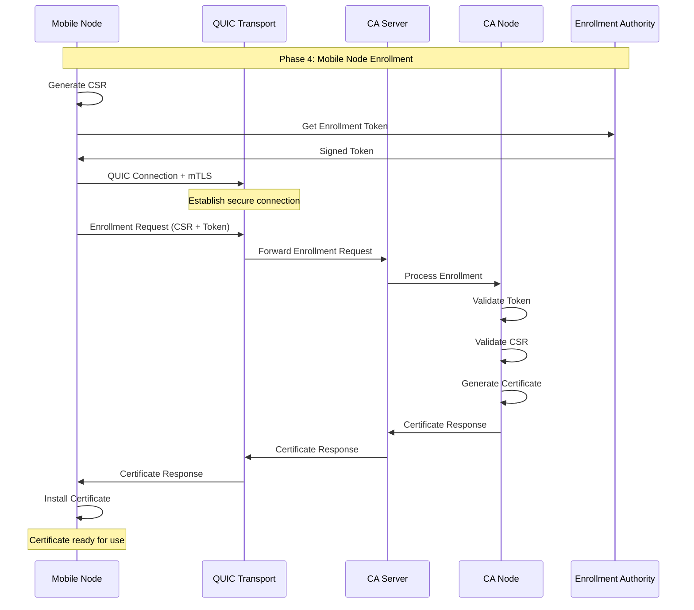
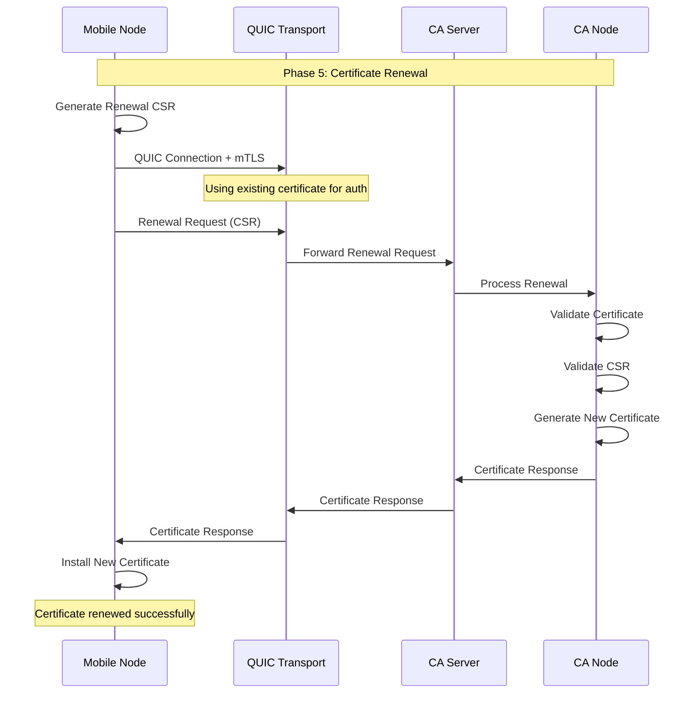
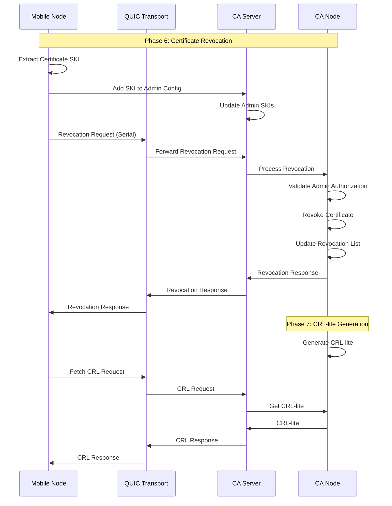
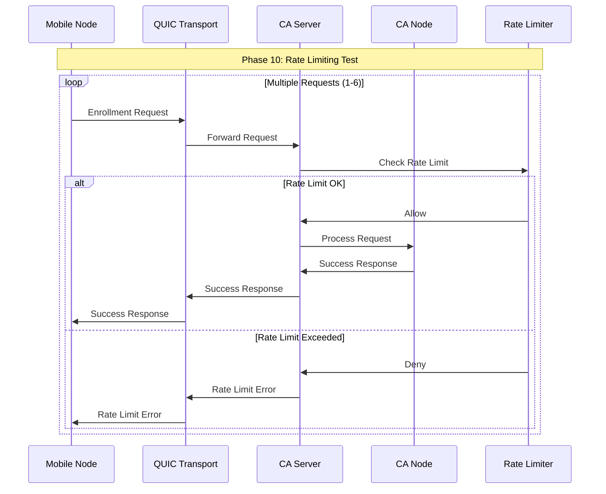
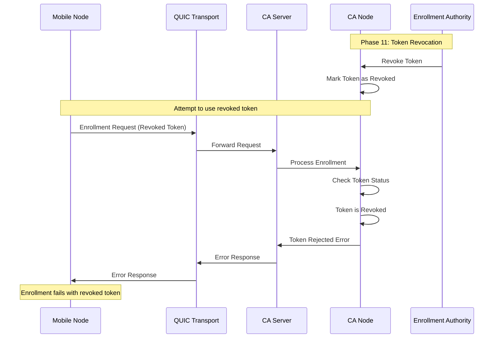
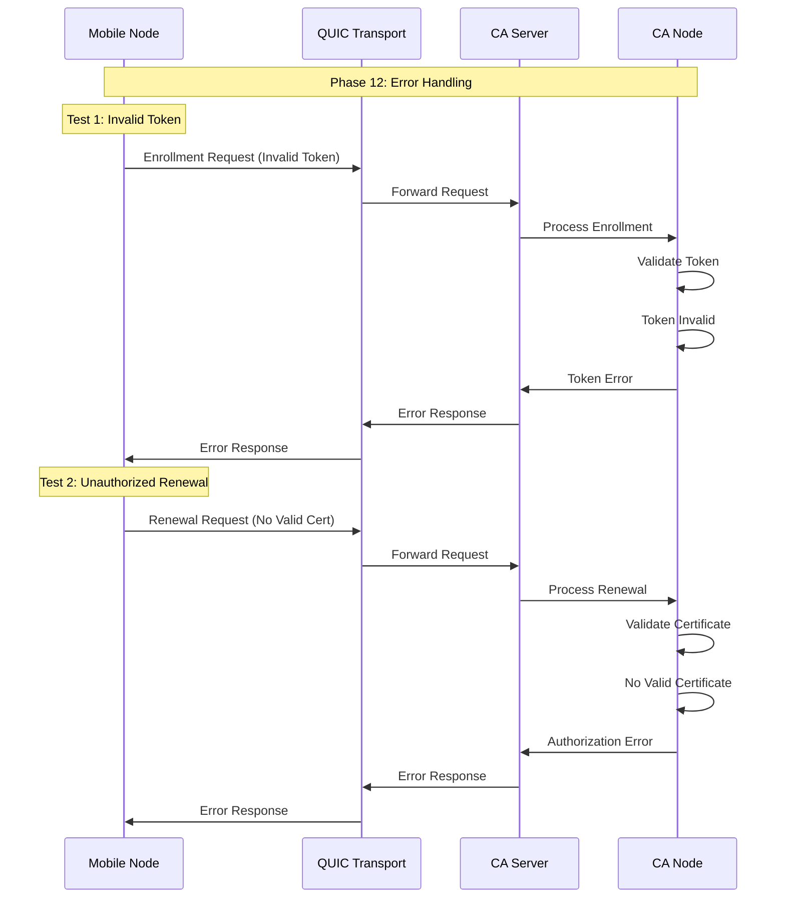
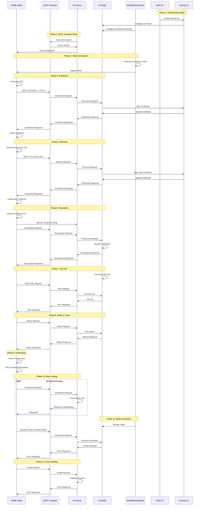
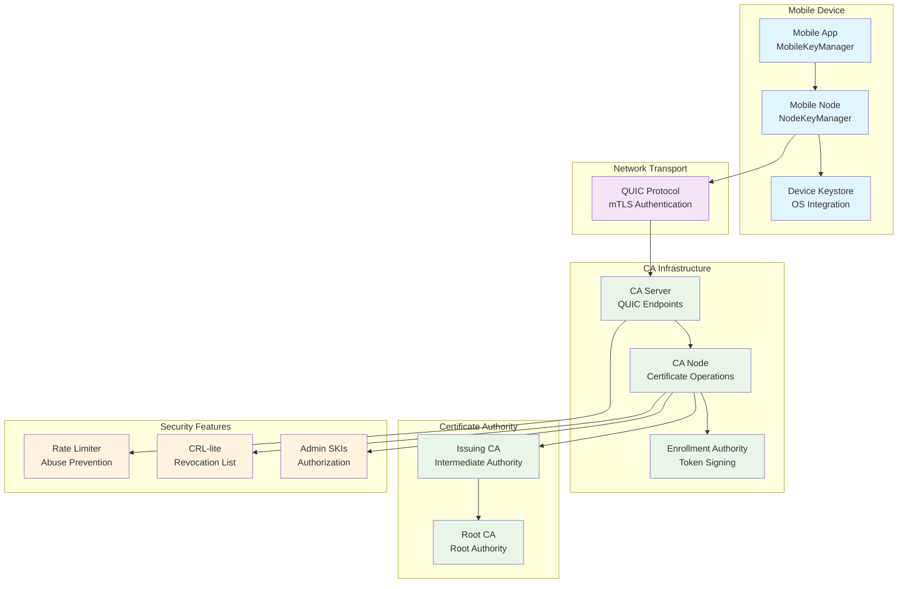
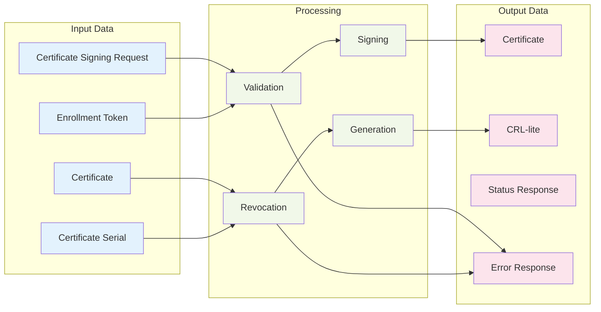
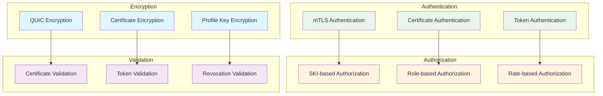

# Full Transport E2E Test - Sequence Diagrams

## 1. Enrollment Flow Sequence Diagram

## 2. Renewal Flow Sequence Diagram

## 3. Revocation Flow Sequence Diagram

## 4. Rate Limiting Sequence Diagram

## 5. Token Revocation Sequence Diagram

## 6. Error Handling Sequence Diagram

## 7. Complete End-to-End Flow

## 8. Component Architecture Diagram

## 9. Data Flow Architecture

## 10. Security Model

